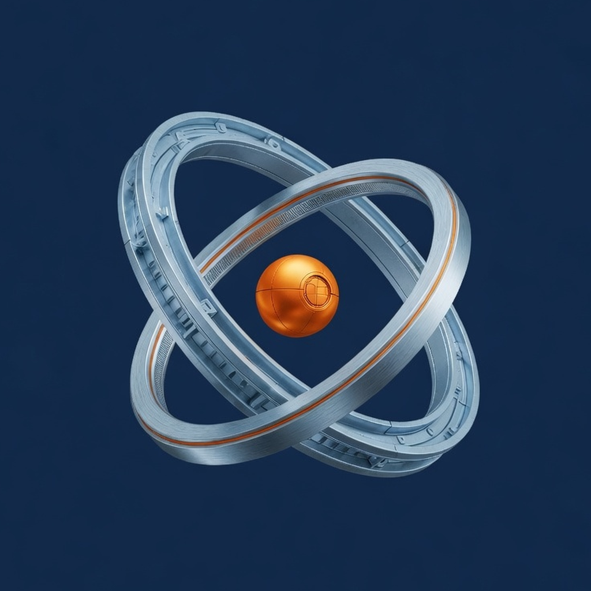
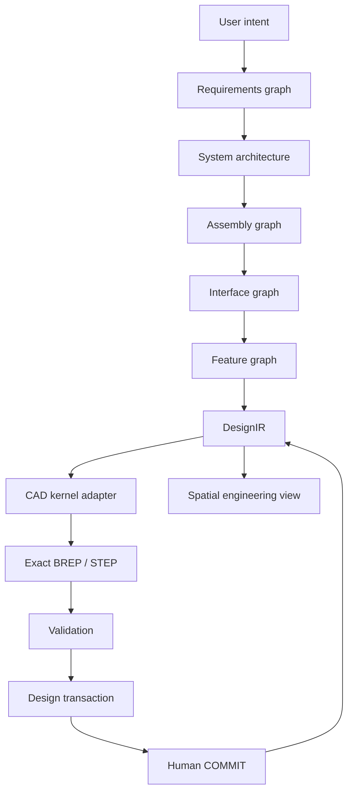

<p align="center">
  
</p>

<h1 align="center">ARCHEON</h1>

<p align="center">
  <strong>v0.6.0 — Executable Mechanical Intelligence</strong><br />
  Governed mechanism reasoning over DesignIR.
</p>

<p align="center">
  
  
  
  
</p>

ARCHEON is not “AI + CAD.” It is an **agent-native spatial engineering operating system**: specialized engineering agents turn requirements into governed, editable, analyzable physical systems. Geometry is one projection of the engineering graph — never the source of truth.

```text
Intent → Requirements → Agents → DesignIR → CAD kernel
       → Validation → Spatial view → Human COMMIT
```

A user should eventually say:

```text
Design a six-axis robotic arm with 800 mm reach,
3 kg payload, serviceable joints,
off-the-shelf bearings, and a parts budget below $2,000.
```

…and get a semantic assembly, interfaces, parametric features, exact solids, critique, visual diffs, and a human commit gate.

This repository is **ARCHEON v0.6.0 — Executable Mechanical Intelligence**. First-class joints, typed mates, explicit feature frames, graph-query tools, validation contracts, and real DTP dry-runs allow the same deterministic runtime to inspect the arm’s shoulder and elbow. Three.js primitives remain a viewport fallback. Agents can READ and PROPOSE; only a human can COMMIT, and committed DesignIR is persisted to the project files.

It does **not** claim a full geometric constraint solver, dynamics, FEA, trajectory collision, manufacturer catalogs, CAM, production qualification, or ISO fit validation.

---

## Why it exists

Most text-to-CAD tools optimize `prompt → shape`. That skips the work that actually makes a machine:

requirements · interfaces · mates · provenance · critique · revision

ARCHEON’s thesis is **agentic systems engineering in 3D**.

HELIX (a fusion digital-assembly workstation) inspired spatial explosion, provenance, and bounded agent actions. ARCHEON does not contain HELIX, Cortex, or fusion physics. It generalizes those ideas into a domain-independent platform.

---

## Architecture

**DesignIR** is the engineering source of truth. The language model does not own geometry. The renderer does not own geometry. The CAD kernel does not own the application.



### Three engineering graphs

| Graph | Holds |
|---|---|
| Requirements | goals, limits, assumptions, acceptance |
| Assembly / interface | parts, ports, mates, flows — **interface is first-class** |
| Feature | datum, sketch, extrude, hole, interface geometry |

Agents refer to **semantic topology** (`Part: ShoulderHousing / Feature: BearingPocket / Datum: JointAxis`), never to unstable kernel IDs such as `face_317`.

### Invariants

1. No rendered object exists without semantic identity.  
2. Agents cannot mutate canonical state.  
3. Canonical changes occur only through Design Transactions.  
4. Every interface connects valid semantic endpoints.  
5. Explosion / isolate / x-ray never destroy identity.  
6. Memory is evidence, not authority.  
7. Render ≠ DesignIR ≠ CAD regeneration ≠ simulation.  
8. CAD kernels are replaceable adapters.  
9. Model providers are replaceable adapters.  
10. Provenance survives revisions.

---

## What ships

| Capability | Status |
|---|---|
| Semantic six-axis arm (DesignIR JSON) | Live |
| Spatial workstation (navigator, inspector, tracker, explode v2) | Live |
| Floating morphing Agent HUD | Live |
| Live Design sessions + async CAD jobs | Live |
| Scene command bus + Ctrl+K palette | Live |
| Design Transaction Protocol + human COMMIT | Live |
| Real CreatePort/Interface/Mate/Datum/Sketch/Extrude/RunAnalysis dry-runs | Live |
| First-class FIXED/REVOLUTE/PRISMATIC joints | Live |
| Generic assembly/joint/interface/load-path graph tools | Live |
| FeatureFrame shared by preview, OCCT path, overlay, and validation | Live |
| Generated TypeScript transport schema with drift check | Live |
| Typed engineering validation contracts | Live; graph/semantic scope |
| Local agent commands (no API key required) | Live |
| Project load (`projects/<name>/`) | Live |
| CAD import (STL, STEP, glTF, OBJ) | Live |
| Kernel STEP/STL for box/cylinder primitives | Live |
| Optional OpenCascade / build123d adapter | Used only if installed |
| FEA / constraint solver / vendor catalogs | **Not implemented** — never invented |

### CAD honesty

| Artifact | Truth class |
|---|---|
| Workstation box/cylinder | DesignIR spatial envelope |
| Imported STL / glTF | `SOURCE_MESH`, never BREP |
| Imported STEP | `EXACT_BREP`; displayed preview is `EXACT_BREP_TESSELLATION` |
| Kernel STEP (supported complete feature set) | `GENERATED_EXACT` |
| Incomplete primitive feature projection | `GENERATED_PREVIEW` or `PRIMITIVE_FALLBACK` |
| Mass | Volume × handbook density → **ASSUMED** |
| Collision | Not checked unless an OCCT Boolean actually ran |

The HUD labels CAD files with `SOURCE` / `GENERATED` and a note. ARCHEON will not call a Three.js mesh a manufacturing model.

---

## Workstation

Windows-first. Ice-blue structure, cybernetic orange for selection / proposals, square HUD.

**Top bar:** project · revision · kernel · mode · validation · explode spread · **IMPORT CAD** · **REGEN CAD** · HARD RESET  

**Left:** Engineering Navigator (system / assembly / parts / features / joints / interfaces / analysis / requirements)  

**Center:** spatial viewport — PBR solids, imported meshes, hierarchical explosion, isolate, x-ray, explode lines, interface markers  

**Right:** Item Tracker + CAD Inspector (not the agent). Selection is nullable; deselect with empty click, Escape, or inspector ×.  

**Bottom:** Feature tree · BOM · Mates · Analysis · Transactions · Validation · Timeline  

**Floating:** ARCHEON Agent HUD — `[◈ AGENT]` morphs into a draggable / resizable instrument (session UI state only; never DesignIR).

Local commands (no key):

```text
give me the shoulder
give me the elbow
what rotates here?
show me the joint
show the load path
make the forearm 50 mm longer
break it apart
show interfaces
show me what this connects to
where is the weakest assumption
clear selection
explode assembly
isolate shoulder
increase upper arm length by 25 mm
validate proposal
commit proposal
```

---

## Install and launch (Windows)

Needs [Rust](https://rustup.rs), [Node.js](https://nodejs.org), and Python 3.12+.

```powershell
git clone https://github.com/jacksonjp0311-gif/ARCHEON.git
cd ARCHEON
.\ARCHEON.ps1
```

That is the **icon compiler** (HELIX-style):

1. Bump `DEV_BUILD` so the UI shows `0.4.0+dev.N`  
2. Compile the workstation if source is newer  
3. Rebuild `archeon.exe` only if Rust / canon changed  
4. Publish `%LOCALAPPDATA%\ARCHEON\ui`  
5. Write Desktop / Start Menu shortcuts  
6. Open through `boot.html` (does not admit a stale bundle)

After the first run, double-click the **ARCHEON** desktop icon. Visible fallback: `.\Launch-Archeon.cmd`. HARD RESET in the topbar queues the same compiler.

Hot-reload (no stamp):

```powershell
.\ARCHEON.ps1 -Dev
```

API: `http://127.0.0.1:8799` · UI (dev): `http://127.0.0.1:5174`

### Load a project / import CAD

- **Project dropdown** in the top bar lists `projects/*/project.json`.  
- **IMPORT CAD** attaches STL / STEP / glTF / OBJ to the selected part, or creates `part.import.*`.  
- **REGEN CAD** writes kernel STEP+STL under `projects/<name>/generated/` (gitignored).  
- Meshes are served from `/api/media/cad/...` and `/api/media/generated/...` (path-jailed).

```powershell
$env:PYTHONPATH = "$PWD\workers\cad-occt"
python -m archeon_cad regenerate --project projects\archeon-arm --json
```

---

## Repository map

```text
ARCHEON/
├─ crates/                 DesignIR · DTP · validation · agents · API
├─ apps/workstation/       React + R3F operator UI
├─ workers/cad-occt/       Python CAD kernel (primitive STEP/STL, optional OCCT)
├─ packages/               Spatial / explosion TypeScript libraries
├─ adapters/               Kernel, AI, memory, export boundaries
├─ agents/                 Agent cards (role, tools, authority)
├─ projects/archeon-arm/   Canonical example DesignIR
├─ assets/brand/           Icon + mark
└─ Open-Archeon.ps1        Hidden desktop-icon compiler
```

---

## Design Transaction Protocol

```text
Request → Plan → Propose → Schema → Dry run → CAD regen
       → Constraints → Checks → Visual proposal
       → Human APPROVE | REJECT | MODIFY → Commit
```

Statuses: `PROPOSED → VALIDATING → VALID | INVALID → APPROVED → COMMITTED` (plus `REJECTED` / `ROLLED_BACK`).

Authority: `READ | PROPOSE | VALIDATE | COMMIT | ADMIN`. Humans keep **COMMIT**. CAD Designer cannot self-commit.

AI provider is an adapter (`mock` | OpenAI-compatible). Default compatible endpoint is SpaceXAI / xAI (`https://api.x.ai/v1`, `grok-4.5`) when `ARCHEON_AI_API_KEY` or `XAI_API_KEY` is set. The app runs without a key.

---

## Tests

```powershell
cargo test --workspace
python -m pytest workers\cad-occt\tests -q
cd apps\workstation; npm test
```

---

## Roadmap (honest)

| Phase | Intent | Status |
|---|---|---|
| 0 | Architecture foundation | shipped |
| 1 | Semantic assembly + spatial workstation + CAD import | this tree |
| 2 | Parametric BREP authoring on OpenCascade | not started |
| 3 | Multi-agent LLM debate | adapter only |
| 4 | Geometric mate solver | semantic mates only |
| 5 | Kinematics / FEA adapters | not started |
| 6 | Cortex memory | stub only — Cortex is not vendored |

See [`ARCHITECTURE.md`](./ARCHITECTURE.md) and [`ROADMAP.md`](./ROADMAP.md).

---

## License

MIT. See [`LICENSE`](./LICENSE).
