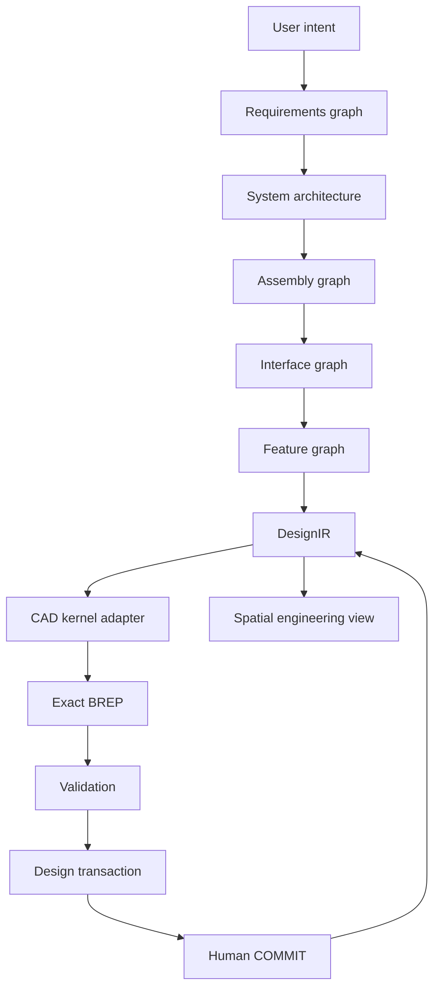
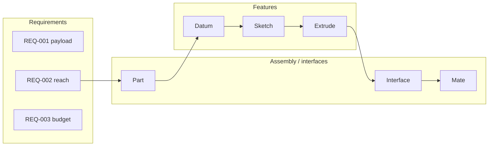

# ARCHEON

**Agentic Spatial Engineering OS**

From intent to engineered reality.

ARCHEON is not “AI + CAD.” It is an agent-native spatial engineering operating system: specialized engineering agents transform requirements into governed, editable, analyzable physical systems. Geometry is one projection of the engineering graph — not the source of truth.

```text
Intent
  → Requirements
  → Agents
  → DesignIR
  → CAD kernel
  → Validation
  → Spatial view
  → Human approval
```

Phase 1 ships a working workstation, a semantic six-axis arm, a Design Transaction Protocol, local agents, and a replaceable CAD worker. It does **not** claim production robot design, FEA, or autonomous CAD.

---

## Why ARCHEON exists

Most text-to-CAD tools optimize:

```text
prompt → shape
```

That skips the work that actually makes a machine: requirements, interfaces, mates, provenance, critique, and revision. ARCHEON’s thesis is:

**Agentic systems engineering in 3D.**

A user should eventually say:

```text
Design a six-axis robotic arm with 800 mm reach,
3 kg payload, serviceable joints,
off-the-shelf bearings, and a parts budget below $2,000.
```

…and get a governed assembly: semantic parts, interfaces, parametric features, exact solids, validation, visual diffs, and a human commit gate.

HELIX (a fusion workstation) inspired spatial explosion, provenance, and bounded agent actions. ARCHEON does not contain HELIX, Cortex, or fusion physics. It generalizes those ideas into a domain-independent platform.

---

## Architecture

DesignIR is the engineering source of truth.

The AI model does not own geometry. The renderer does not own geometry. The CAD kernel does not own the application.



### Three engineering graphs



| Graph | Holds |
|---|---|
| Requirements | goals, limits, assumptions, acceptance criteria |
| Assembly / interface | parts, ports, mates, flows — **interface is first-class** |
| Feature | datum, sketch, extrude, hole, pattern, interface geometry |

Agents refer to **semantic topology** (`Part: ShoulderHousing / Feature: BearingPocket / Datum: JointAxis`), never to unstable kernel IDs such as `face_317`.

---

## Design Transaction Protocol (DTP)

Agents never write canonical state.

```text
Request → Plan → Propose → Schema check → Dry run
       → Geometry regen → Constraints → Collision
       → Engineering checks → Visual proposal
       → Human APPROVE | REJECT | MODIFY → Commit
```

Statuses: `PROPOSED → VALIDATING → VALID | INVALID → APPROVED | REJECTED → COMMITTED | ROLLED_BACK`.

Authority classes: `READ | PROPOSE | VALIDATE | COMMIT | ADMIN`. Humans keep `COMMIT`.

---

## Agents

Agents are not different prompts. Each has a role, tools, allowed operations, authority, and an output schema.

| Agent | Phase 1 |
|---|---|
| Architect | requirement interpretation, subsystem split |
| CAD Designer | parametric features, dimension changes (propose only) |
| Assembly Designer | mates, packaging, spatial roles |
| Constraint Engineer | under/overconstraint heuristic |
| Analysis Engineer | kinematics reach (derived); **no FEA** |
| DFM Reviewer | impossible-feature heuristics |
| Components | catalog **abstraction only** — no vendor API, no invented prices |
| BOM | quantity aggregation; cost remains `UNVERIFIED` |
| Spatial Director | explode / isolate / x-ray / interfaces |
| Critic | missing interfaces, requirement gaps |
| Memory Curator | local evidence notes; Cortex is a stub adapter |

Local deterministic commands work without an AI key:

```text
explode assembly
isolate shoulder
show interfaces
show requirements
select base
reset view
increase upper arm length by 25 mm
validate proposal
commit proposal
reject proposal
```

The AI provider is an adapter (`mock` | `openai-compatible`). Default compatible endpoint is SpaceXAI / xAI (`https://api.x.ai/v1`, `grok-4.5`) when `ARCHEON_AI_API_KEY` or `XAI_API_KEY` is set.

---

## CAD kernel

Exact geometry is produced by `workers/cad-occt` through `CadKernelAdapter`.

| Adapter | Status |
|---|---|
| `PrimitiveKernelAdapter` | **implemented** — writes real ISO-10303 STEP (planar box B-rep, cylindrical solids) and STL tessellations |
| `Build123dKernelAdapter` | implemented, used **only if** `build123d`/`OCP` import; otherwise reports unavailable |
| Zoo / FreeCAD / Fusion / Onshape | adapter stubs, not implemented |

The Three.js scene is a **spatial projection of DesignIR**, not a manufacturing CAD model. HUD labels say so.

---

## Spatial engine

```text
renderTransform =
    canonicalAssemblyTransform
  + explosionTransform
  + focusTransform
  + serviceTransform
  + agentProposalTransform
```

Explosion is an alternate spatial projection of the assembly graph, not a bounce animation.

Modes: `ASSEMBLED`, `EXPLODED`, `SYSTEM_EXPLODED`, `PART_EXPLODED`, `SERVICE`, `ISOLATE`, `X_RAY`, `CUTAWAY`, `PROVENANCE`, `INTERFACES`, `CONSTRAINTS`, `REQUIREMENTS`, `AGENT_PROPOSAL`, `DIFF`.

Strategies: `RADIAL`, `AXIAL`, `SEQUENCE`, `SYSTEM`, `BOM_FOCUS`, `SERVICE`, `GRAPH`, `CUSTOM`.

---

## Memory

`MemoryProvider` is evidence only. It cannot mutate DesignIR.

- `LocalMemoryProvider` — JSON files under `memory/`
- `CortexMemoryProvider` — documented stub. Cortex is **not** embedded or modified.

---

## Example project — ARCHEON Arm

A simplified six-axis benchtop arm used to prove architecture, not to qualify a robot.

| Spec | Value | Truth |
|---|---|---|
| Payload | ≥ 3 kg | requirement (`UNVERIFIED` capability) |
| Reach | ≥ 800 mm | requirement; derived from link lengths |
| DOF | 6 | design intent |
| BOM cost | ≤ $2,000 | requirement; **catalog not connected, no prices invented** |
| Structure | modular, serviceable joints | intent |
| Geometry | parametric boxes/cylinders | simplified prototype solids |

Assemblies: Base → Shoulder → Upper Arm → Elbow → Forearm → Wrist → End Effector.

---

## Install and run (Windows)

Needs Rust, Node.js, and Python 3.12+.

```powershell
cd $HOME\Desktop\ARCHEON
.\ARCHEON.ps1
```

That starts the Rust API on `http://127.0.0.1:8799` and the Vite workstation on `http://127.0.0.1:5174`.

Manual:

```powershell
cargo test --workspace
cargo run -p archeon-api
# other terminal
cd apps\workstation
npm install
npm run dev
```

CAD regen (optional):

```powershell
python workers\cad-occt\ -m archeon_cad regenerate --project projects\archeon-arm
```

If `build123d` is not installed, the primitive STEP writer still produces exact box/cylinder solids. That is real STEP, not a mesh renamed as CAD. It is still a **simplified prototype kernel**, not OpenCascade.

---

## Repository

```text
ARCHEON/
├─ crates/                 Rust: DesignIR, DTP, validation, agents, API
├─ apps/workstation/       React + R3F operator UI
├─ workers/cad-occt/       Python CAD kernel worker
├─ packages/               Spatial / explosion TypeScript libraries
├─ adapters/               Kernel, AI, memory, export boundaries
├─ agents/                 Agent cards (role, tools, authority)
├─ domains/                Domain packs (mechanical, robotics, …)
├─ projects/archeon-arm/   Canonical example DesignIR
├─ tests/                  Cross-cutting tests
├─ benchmarks/             Measurement schema (no invented scores)
└─ docs/                   Architecture notes and schemas
```

---

## Roadmap (honest)

Phase 1 is **semantic assembly + spatial workstation + governed transactions**. Parametric BREP authoring, full constraint solvers, analysis, Cortex memory, vendor intelligence, and multidisciplinary packs are later phases. See [`ROADMAP.md`](./ROADMAP.md) and [`ARCHITECTURE.md`](./ARCHITECTURE.md).

---

## License

MIT. See [`LICENSE`](./LICENSE).
